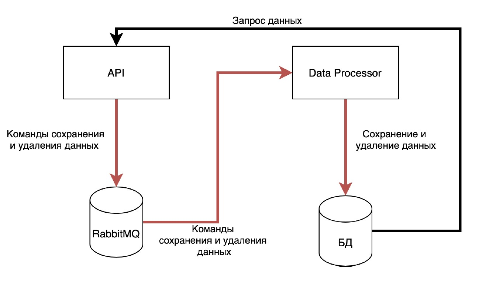

# YLab_Java-03.23
YLab - Intensive course Java 03.23

## Занятие 4 
(PosgtreSQL, JDBC, RabbitMQ)

#### Task_1: MovieDatabase. [{_solution package_}](https://github.com/kreved77/YLab_Java-03.23/blob/main/src/io/ylab/intensive/lesson04/movie)
 
В [csv-файле](https://perso.telecom-paristech.fr/eagan/class/igr204/data/film.csv) содержаться данные о фильмах, вида:

      Year;Length;Title;Subject;Actor;Actress;Director;Popularity;Awards;*Image
      INT;INT;STRING;CAT;CAT;CAT;CAT;INT;BOOL;STRING
      1979;122;Cuba;Action;Connery, Sean;Adams, Brooke;Lester, Richard;6;No;seanConnery.png

_(Обратить внимание, что в файле некоторые значения могут
отсутствовать.)_

Необходимо: 
1. Реализовать код, читающий данные из файла и записывающий в таблицу через JDBC. Для добавления данных использовать PreparedStatement.

   В работе необходимо использовать следующий класс:

         class Movie {
            private Integer year;
            private Integer length;
            private String title;
            private String subject;
            private String actors;
            private String actress;
            private String director;
            private Integer popularity;
            private Boolean awards;
         }

   Данные, считываемые из файла должны быть упакованы в экземпляр указанного класса. Затем этот экземпляр должен передаваться коду, который будет отвечать за сохранение данных в БД.

2. Для созданной таблицы написать запрос, выводящий количество фильмов каждого жанра (GROUP BY). Запрос написать в комментариях к коду решения.

#### Task_2: PersistentMap. [{_solution package_}](https://github.com/kreved77/YLab_Java-03.23/blob/main/src/io/ylab/intensive/lesson04/persistentmap)

Необходимо реализовать Map, хранящий свое состояние исключительно в базе данных. То есть, любое изменение данных Map (добавление и удаление), а также получение данных должно транслироваться в соответствующие SQL запросы. Данные
необходимо хранить в таблице следующего вида:

      CREATE TABLE persistent_map (
         map_name varchar,
         KEY varchar,
         value varchar
      );
      
      name - имя экземпляра Map
      key - ключ в экземпляре Map
      value - значение, соответствующее ключу в текущем экземпляре Map

Реализация состоит в реализации следующего интерфейса:

      public interface PersistentMap {
         void init(String name);
         boolean containsKey(String key) throws SQLException;
         List<String> getKeys() throws SQLException;
         String get(String key) throws SQLException;
         void remove(String key) throws SQLException;
         void put(String key, String value) throws SQLException;
         void clear() throws SQLException;
      }

**init.** Метод используется для инициализации нового экземпляра Map. Принимает имя текущего экземпляра. Данные всех экземпляров хранятся в одной таблице, и имя используется для того, чтобы отделять данные одного экземпляра от данных другого.

**containsKey.** Возвращает true тогда и только тогда, когда существует значение, связанное с данным ключом, false - в противном случае.

**getKeys.** Возвращает список ключей, для которых есть значения в БД.

**get.** Возвращает значение, связанное с переданным ключом
remove. Удаляет пару ключ/значение из Map.

**put.** Служит для добавления новой пары ключ-значение. В своей работе сначала удаляет существую пару из Map (если она есть), а затем добавляет новую.

**clear.** Удаляет все данные из текущего экземпляра Map.

_**Допущение**: можно считать, что одновременно только одно приложение будет работать с конкретным экземпляром. То есть, соблюдение строгой транзакционности и реализация многопоточной работы не обязательны!_

#### Task_3: FileSortReturns. [{_solution package_}](https://github.com/kreved77/YLab_Java-03.23/blob/main/src/io/ylab/intensive/lesson04/filesort)

Реализовать интерфейс:

      public interface FileSorter {
         File sortFile(File dataFile) throws Exception;
      }
Реализация интерфейса получает на вход файл, состоящий из чисел (long), разделенных переносом строки и возвращает файл, в котором эти числа **отсортированы в порядке убывания**.

1. Можно считать, что максимальный размер файла - 1000000 чисел
2. Сортировку необходимо реализовать средствами БД
3. Работа с БД - средствами JDBC
4. При вставке данных обязательно использовать batch-processing.

_Необязательно: 5. Реализовать версию без batch-processing, сравнить производительность_

#### Task_4: EventSourcing. [{_solution package_}](https://github.com/kreved77/YLab_Java-03.23/blob/main/src/io/ylab/intensive/lesson04/eventsourcing)
Написать 2 приложения, реализующие функционал асинхронной записи данных в БД.

Приложение оперирует классом Person, содержащий данные о людях:

      class Person {
         private Long id;
         private String name;
         private String lastName;
         private String middleName;
         // Getters, Setters, Constructor
      }

Задача состоит из написания двух приложений, одно из которых содержит реализацию интерфейса взаимодействия с системой, второе - для взаимодействия с БД.

Архитектура представлена ниже:

**Приложение DataProcessor**

Принимает из RabbitMQ сообщения о добавлении/удалении данных, затем выполняет в БД соответствующие запросы.
Необходимо, чтобы сообщения, отправленные первыми, обрабатывались также первыми (чтобы принцип FIFO не нарушался).

**Приложение API**

Приложение содержит реализацию следующего интерфейса:

      public interface PersonApi {
         void deletePerson(Long personId);
         void savePerson(Long personId, String firstName, String lastName,
         String middleName);
         Person findPerson(Long personId);
         List<Person> findAll();
      }

**deletePerson** - генерирует сообщение-команду на удаление персоны с заданным id. Далее это сообщение должно быть обработано соответствующим запросом, выполняя удаление данных. _Если данных для определенного personId не найдено - выводить в лог сообщение, что была попытка удаления, но при этом данные не найдены. Exception или другую ошибку не выдавать._

**savePerson** - генерирует сообщение-команду на сохранение данных персоны. Обработчик должен проверить, существует ли в БД персона с переданным personId. _Если существует - необходимо выполнить обновление данных (обновить три поля firstName, lastName, middleName). Если не существует - создать персону с переданным personId._

**findPerson** - Генерирует запрос напрямую в БД и возвращает данные персоны, _если персона для данного personId найдена, null в противном случае_

**findAll** - Генерирует запрос напрямую в БД и возвращает данные о ВСЕХ сохраненных в базе персонах.

**Замечания по реализации**
1. Формат сообщений для сохранения и удаления данных разработать
   самостоятельно.
2. Приложения можно разрабатывать в одном пакете, просто с двумя классами, в которых есть метод main(String[].. args). Тогда запуск каждого приложения - запуск соответствующего класса:

         io.ylab.intensive.lesson04.eventsourcing.api.ApiApp
         io.ylab.intensive.lesson04.eventsourcing.db.DbApp
3. В случае возникновения ошибок и исключений - писать данные об этом в консоль.
4. Контролировать случай, что запрос данных возможен только после обработки всех сообщений - не надо никак! Методы поиска должны возвращать то, что есть в БД на текущий момент.
5. Реализация остается на усмотрение исполнителя, проверка будет заключаться в проверке реализации интерфейса PersonApi.

## Занятие 3 
(Java Collections, IO, Exceptions)

#### Task_1: Transliterator. [{_solution package_}](https://github.com/kreved77/YLab_Java-03.23/blob/main/src/Lesson3/Task_1)
Реализовать интерфейс Transliterator. 
Метод transliterate должен выполнять транслитерацию входной строки в выходную, то есть заменять каждый символ кириллицы на соответствующую группу символов латиницы. Каждый символ кириллицы, имеющийся во входной строке входит в нее в
верхнем регистре.

      transliterate("HELLO! ПРИВЕТ! Go, boy!") -> HELLO! PRIVET! Go, boy!

#### Task_2: DatedMap. [{_solution package_}](https://github.com/kreved77/YLab_Java-03.23/blob/main/src/Lesson3/Task_2)
Реализовать интерфейс DatedMap.
DatedMap - это структура данных, очень похожая на Map, но содержащая дополнительную информацию: время добавления каждого ключа. При этом время хранится только для тех ключей, которые присутствуют в Map.

      Методы:
      put. Помещает в map пару ключ и значение. Как видно из описания метода, ключ и значение - это строки (семантика Map#put)
      get. Возвращает значение, связанное с переданным в метод ключом. Если для переданного ключа значение отсутствует - возвращается null (семантика Map#get)
      containsKey. Метод, проверяющий, есть ли в map значение для данного ключа(семантика Map#containsKey).
      remove. Получая на вход ключ, удаляет из map ключ и значение, с ним связанное(семантика Map#remove)
      ketSet. Возвращает множество ключей, присутствующее в map (семантика Map#keySet)
      getKeyLastInsertionDate. Получая на вход ключ, проверяет, что для данного ключа существует значение в map. Если существует - возвращает дату, когда оно было добавлено. Если нет - возвращает null

#### Task_3: OrgStructureParser. [{_solution package_}](https://github.com/kreved77/YLab_Java-03.23/blob/main/src/Lesson3/Task_3)
Необходимо написать программу: получает на вход CSV файл формата, и формирует структуру объектов класса.

Реализовать интерфейс OrgStructureParser.
Метод parseStructure должен считывать данные из файла и возвращать ссылку на Босса (Генерального директора) - сотрудника, атрибут boss_id которого не задан, и вывести список прямых подчиненных (subordinates).

*Структура организации записана в виде строк в CSV файле. CSV - файл - это простой текстовый файл, содержащий строки. Каждая строка представляет собой одну запись(объект). Поля объекта разделены специальным символом ;. Первая строка файла содержит поля имена полей, все дальнейшие сроки содержат непосредственно данные*

      Пример:
         id;boss_id;name;position
         1;;Иван Иванович;Генеральный директор
         2;1;Крокодилова Людмила Петровна;Главный бухгалтер
         3;2;Галочка;Бухгалтер
         4;1;Сидоров Василий Васильевич;Исполнительный директор
         5;1;Зайцев Валерий Петрович;Директор по ИТ
         6;5;Петя;Программист

      В файле поле id обозначает уникальный идентификатор сотрудника, 
         boss_id идентификатор начальника,
         name - имя сотрудника, 
         position - должность.
      Таким образом, данные в файле описывают иерархию сотрудников!

#### Task_4: PasswordValidator. [{_solution package_}](https://github.com/kreved77/YLab_Java-03.23/blob/main/src/Lesson3/Task_4)
1. Создать статический метод, который принимает на вход три параметра: login, password и confirmPassword.
2. Login должен содержать только латинские буквы, цифры и знак подчеркивания.

      _Если login не соответствует - выбросить WrongLoginException с текстом “Логин содержит недопустимые символы”_
3. Длина login должна быть меньше 20 символов. 

      _Если login не соответствует этим требованиям, необходимо выбросить WrongLoginException с текстом “Логин слишком длинный”_
4. Password должен содержать только латинские буквы, цифры и знак подчеркивания. 

      _Если password не соответствует этим требованиям, необходимо выбросить WrongPasswordException с текстом “Пароль содержит недопустимые символы”_
5. Длина password должна быть меньше 20 символов. 

      _Если password не соответствует этим требованиям, необходимо выбросить WrongPasswordException с текстом “Пароль слишком длинный”_
6. Также password и confirmPassword должны быть равны. 

      _Если password не соответствует этим требованиям, необходимо выбросить WrongPasswordException с текстом “Пароль и подтверждение не совпадают”_
7. WrongPasswordException и WrongLoginException - пользовательские классы исключения с двумя конструкторами – один по умолчанию, второй принимает сообщение исключения и передает его в конструктор класса Exception.
8. Обработка исключений проводится внутри метода. Обработка исключений - вывод сообщения об ошибке консоль
9. Метод возвращает true, если значения верны или false в другом случае.

#### Task_5: FileSort_ExternalMergeSort. [{_solution package_}](https://github.com/kreved77/YLab_Java-03.23/blob/main/src/Lesson3/Task_5_FileSort_ExternalMergeSort)
Задача - реализовать метод Sorter.sortFile используя алгоритм внешней сортировки слиянием.

Даны следующие классы:

 - Класс Generator, которые генерирует файл с заданными количеством чисел типа long
 - Класс Validator, который проверяет, что файл отсортирован по возрастанию
 - Класс Sorter, который получает на вход файл с числами, и возвращает отсортированный по возрастанию файл
 - Класс Test, который запускает генерацию файла, затем сортировку и проверку, что файл отсортирован

Решение долго быть реализовано таким образом, чтобы поддерживать сортировку файлов произвольно большого размера.
Для проверки сгенерировать файл из **375_000_000 записей**, тогда объем файла, который надо будет отсортировать, будет равен 7-8 Гб

## Занятие 2
(Интерфейс + Реализация + Демонстрация)

#### Task_1: Sequences. [{_solution package_}](https://github.com/kreved77/YLab_Java-03.23/blob/main/src/Lesson2/Task_1)
Реализовать интерфейс, каждый метод которого
принимает число N и выводит в консоль N элементов соответствующей последовательности. Необходимо найти закономерности, по которым сформированы эти последовательности:

    A. 2, 4, 6, 8, 10...
    B. 1, 3, 5, 7, 9...
    C. 1, 4, 9, 16, 25...
    D. 1, 8, 27, 64, 125...
    E. 1, -1, 1, -1, 1, -1...
    F. 1, -2, 3, -4, 5, -6...
    G. 1, -4, 9, -16, 25...
    H. 1, 0, 2, 0, 3, 0, 4...
    I. 1, 2, 6, 24, 120, 720...
    J. 1, 1, 2, 3, 5, 8, 13, 21...

#### Task_2: ComplexNumbers. [{_solution package_}](https://github.com/kreved77/YLab_Java-03.23/blob/main/src/Lesson2/Task_2)
Реализовать класс, описывающий комплексное число (действительная и мнимая часть имеют точность double). Должны быть доступны следующие операции (арифметические действия создают новый экземпляр класса):
1. Cоздание нового числа по действительной части (конструктор с 1 параметром)
2. Создание нового числа по действительной и мнимой части (конструктор с 2 параметрами)
3. Сложение
4. Вычитание
5. Умножение
6. Операция получения модуля
7. преобразование в строку (toString)
   
   Написать код, демонстрирующий работу с созданными классами

#### Task_3: RateLimitedPrinter. [{_solution package_}](https://github.com/kreved77/YLab_Java-03.23/blob/main/src/Lesson2/Task_3)
Реализовать класс RateLimitedPrinter, который  ограничивает частоту вывода сообщений в консоль. Класс имеет конструктор, в который передается interval и метод print(), в который передается строка. 

Класс функционирует по следующему принципу: на объекте класса вызывается метод print(). Далее идет проверка, когда был последний вывод в консоль. Если интервал (в миллисекундах) между последним состоявшимся выводом и текущим выводом больше значения interval, переданного в конструктор - то происходит вывод значения. Иначе - не происходит, и сообщение отбрасывается. Другими словами, сообщение не будет выводится чаще чем 1 раз в interval милисекунд.

#### Task_4: SnilsValidator. [{_solution package_}](https://github.com/kreved77/YLab_Java-03.23/blob/main/src/Lesson2/Task_4)
Реализовать интерфейс SnilsValidator, который возвращает true если номер СНИЛС валидный, false - в противном случае.
Номер передается в виде строки, содержащей исключительно цифры 0-9.

Номер СНИЛС состоит из 11 цифр. Валидация номера СНИЛС выполняется по следующим правилам: [(Валидация и проверка контрольного числа СНИЛС)](http://www.kholenkov.ru/data-validation/snils/)

#### Task_5: StatsAccumulator. [{_solution package_}](https://github.com/kreved77/YLab_Java-03.23/blob/main/src/Lesson2/Task_5)
Необходимо реализовать интерфейс StatsAccumulator. Решение должно использовать O(1) памяти.

Объект данного класса, будучи созданным, может принимать значения через метод add. 
Приняв значение, объект меняет свое внутреннее состояние, чтобы в любой момент времени предоставить данные о:

    • количестве переданных ему элементах, 
    • минимальному их них, 
    • максимальному из них, 
    • среднем арифметическом всех переданных ему элементов

## Занятие 1

#### Task_1_Stars. [{_solution code_}](https://github.com/kreved77/YLab_Java-03.23/blob/main/src/Lesson1/Task_1_Stars.java)
Программе передается 3 параметра: количество строк, количество столбцов, произвольный символ. 
Необходимо вывести  фигуру, состоящую из заданного списка строк и заданного количества столбцов, в которой каждый элемент равен указанному символу.

Ввод: n m c / Вывод: фигура

Пример:

    Ввод:           Вывод:
    2 3 $    =>     $ $ $
                    $ $ $

#### Task_2_Pell.   [{_solution code_}](https://github.com/kreved77/YLab_Java-03.23/blob/main/src/Lesson1/Task_2_Pell.java)
Числа Пелля задаются следующим соотношением:

            0                (n = 0)
            1                (n = 1)
            2*[n-1]+[n-2]    (n > 1)

На вход подается число n (0 <= n <= 30), необходимо распечатать n-e число Пелля.

Пример:

    Ввод:           Вывод:
    5       =>      29

#### Task_3_MultTable.   [{_solution code_}](https://github.com/kreved77/YLab_Java-03.23/blob/main/src/Lesson1/Task_3_MultTable.java)
На вход ничего не подается, необходимо распечатать таблицу умножения чисел от 1 до 9 (включая)

Пример:

    Вывод:
    1 x 1 = 1
    1 x 2 = 2
    …
    …
    9 x 9 = 81

#### Task_4_Guess.   [{_solution code_}](https://github.com/kreved77/YLab_Java-03.23/blob/main/src/Lesson1/Task_4_Guess.java)
Игра угадайка. При запуске программа загадывает число от 1 до 99 (включительно) и дает пользователю 10 попыток отгадать. 

Далее пользователь начинает вводить число. И тут возможен один из следующих вариантов:
- Пользователь отгадал число. В таком случае выводится строка: _“Ты угадал с N попытки”_, где N - номер текущей попытки пользователя
- Пользователь ввел число, больше(/меньше) загаданного. В таком случае выводится сообщение: _“Мое число меньше(/больше)! У тебя осталось M попыток”_, где M - количество оставшихся попыток
- У пользователя закончились попытки, и число не было угадано.
